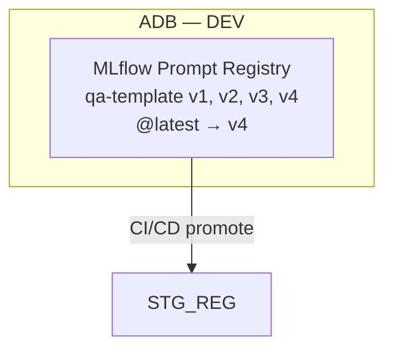

# Mermaid Diagram Creation & Excalidraw Conversion

This skill covers the end-to-end workflow of turning dense technical prose in a
Markdown document into visual diagrams the user can view (`.svg`) and edit
(`.excalidraw`) in VS Code.

## Phase 1 — Analyze the Article & Create Mermaid Diagrams

### 1.1 Identify Diagram Candidates

Read the entire Markdown file and look for sections that would benefit from a
visual representation. Good candidates include:

| Pattern | Diagram type |
|---|---|
| Multi-environment architectures (DEV → STG → PRD) | `flowchart TB` with subgraphs |
| Object anatomy / tree structures | `graph LR` |
| Step-by-step lifecycle or promotion workflows | `flowchart TD` |
| Temporal interactions between services | `sequenceDiagram` |
| Decision trees / fallback chains | `flowchart TD` with diamond nodes |
| Evaluation gates / CI-CD pipelines | `flowchart TD` |

### 1.2 Write Mermaid Code

For each candidate section, write a Mermaid diagram following these rules:

- Use **fenced code blocks** with the `mermaid` language tag.
- Prefer `flowchart` over `graph` for directional layouts (TB, TD, LR).
- Use `subgraph ID["Display Label"]` for grouped environments or categories.
- Use `:::className` or inline styles sparingly; keep diagrams portable.
- For multi-line node labels use `<br>` (rendered by Mermaid as line breaks).
- For sequence diagrams, use `participant` with aliases for readability.
- Keep diagrams self-contained — each one should be understandable in isolation.

### 1.3 Insert Into Markdown

Replace the corresponding ASCII art, bullet lists, or dense prose with the
fenced Mermaid block. Keep any preceding section heading intact.

**Example replacement:**

````markdown
### 2.1 Infrastructure Layout


````

## Phase 2 — Convert Mermaid Blocks to Excalidraw & SVG

### 2.1 Conversion Script

This skill includes a Node.js conversion script and its dependencies.
The script lives in the skill directory at:

```
.github/skills/mermaid-to-excalidraw/scripts/convert_mermaid_to_excalidraw.mjs
.github/skills/mermaid-to-excalidraw/scripts/package.json
```

### 2.2 Setup (One-Time)

Run these commands from the skill's `scripts/` directory:

```bash
cd .github/skills/mermaid-to-excalidraw/scripts
npm install
npx playwright install chromium
```

If the project already has a `scripts/` directory with the converter copied
there, use that instead.

### 2.3 Generate Diagrams

```bash
node convert_mermaid_to_excalidraw.mjs <path-to-markdown-file>
```

This will:
1. Extract every `` ```mermaid `` code block from the Markdown file.
2. Render each to a **`.svg`** file with native `<text>` elements (no
   `<foreignObject>` — works in VS Code, GitHub, and image viewers).
3. Convert each to a **`.excalidraw`** file in native Excalidraw JSON format
   with proper bound text elements (editable in the VS Code Excalidraw
   extension).
4. Save all outputs to a `diagrams/` directory next to the Markdown file.

### 2.4 Replace Code Blocks with Image References

To also replace the Mermaid code blocks in the Markdown with image links:

```bash
node convert_mermaid_to_excalidraw.mjs --replace <path-to-markdown-file>
```

Each `` ```mermaid ... ``` `` block will be replaced with:

```markdown

```

### 2.5 Output Files

| File | Purpose |
|---|---|
| `diagrams/NN-slug.svg` | Portable SVG — viewable everywhere |
| `diagrams/NN-slug.excalidraw` | Native Excalidraw JSON — open and edit in VS Code with the Excalidraw extension |

## Phase 3 — Verification

After generating diagrams, verify the outputs:

### SVG Verification
- Confirm **zero** `<foreignObject>` elements (text must use native `<text>`).
- Confirm each SVG has `<text>` and `<tspan>` elements with readable content.

### Excalidraw Verification
- Confirm **zero** elements with a `label` property (skeleton format eliminated).
- Confirm every text element has a `containerId` pointing to its parent shape.
- Confirm parent shapes have `boundElements` arrays referencing their text.
- Open a `.excalidraw` file in VS Code to visually confirm text is visible.

## Technical Notes

### Known Pitfalls & Their Solutions

1. **Mermaid v11 `<foreignObject>` issue**: Mermaid v11 flowcharts always
   render labels using `<foreignObject>` with embedded HTML. These only display
   in browsers. The conversion script post-processes the SVG in Playwright,
   replacing every `<foreignObject>` with native SVG `<text>` + `<tspan>`
   elements.

2. **Excalidraw skeleton vs. native format**: The
   `@excalidraw/mermaid-to-excalidraw` library returns "skeleton" elements with
   a `label` property embedded inside shapes. The Excalidraw editor does not
   understand this format. The script includes a `convertSkeletonToNative()`
   function that creates separate `type: "text"` elements with `containerId`
   and adds `boundElements` to parent shapes.

3. **Arrow bindings**: Skeleton arrows use `start: { id }` / `end: { id }`.
   Native Excalidraw uses `startBinding: { elementId, focus, gap }` /
   `endBinding`. The converter handles this transformation and also adds arrow
   references to target shapes' `boundElements` arrays.

### Supported Mermaid Diagram Types

- `flowchart` / `graph` (TB, TD, LR, RL, BT)
- `sequenceDiagram`
- Subgraphs, diamond decision nodes, styled edges

### Dependencies

- **Node.js** ≥ 18
- **Playwright** (Chromium) — headless browser for Mermaid rendering
- **Mermaid v11** — loaded from CDN (`esm.sh`) at runtime
- **@excalidraw/mermaid-to-excalidraw v0.3** — loaded from CDN at runtime

## Complete Workflow Checklist

1. [ ] Read the Markdown article end to end
2. [ ] Identify 4–8 sections that benefit from diagrams
3. [ ] Write Mermaid code blocks for each candidate
4. [ ] Insert Mermaid blocks into the Markdown (replacing ASCII art or dense prose)
5. [ ] Set up the conversion script (`npm install` + `npx playwright install chromium`)
6. [ ] Run `node convert_mermaid_to_excalidraw.mjs <file.md>` to generate `.svg` + `.excalidraw`
7. [ ] Verify SVG files: no `<foreignObject>`, proper `<text>` elements
8. [ ] Verify `.excalidraw` files: no `label` properties, proper `containerId`/`boundElements`
9. [ ] Run with `--replace` to swap Mermaid blocks for `` image refs
10. [ ] Commit `diagrams/` directory alongside the updated Markdown
